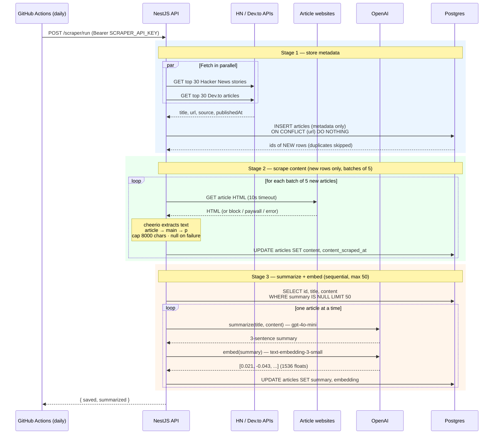
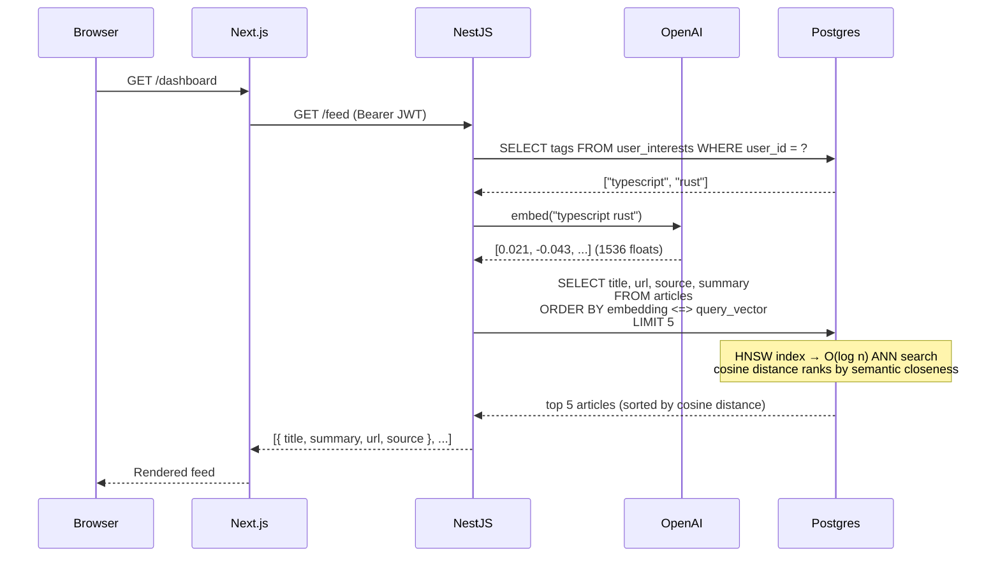

# AI Developer Feed

Personalized developer news feed. Sign in with Google, pick interest tags, get articles from Hacker News and Dev.to ranked by vector similarity. Includes a RAG chat to ask questions against your feed.

## Stack

| Layer | Tech |
|---|---|
| Frontend | Next.js 16, Tailwind CSS, TypeScript |
| Backend | NestJS 11, TypeScript |
| Database | PostgreSQL 16 + pgvector (Neon in prod, Docker locally) |
| Scheduling | GitHub Actions cron → `POST /scraper/run` (wakes Render free-tier + triggers pipeline); `@nestjs/schedule` in-process fallback |
| ORM | Drizzle ORM |
| AI | OpenAI `gpt-4o-mini` + `text-embedding-3-small` |
| Auth | Google OAuth 2.0 → JWT (HttpOnly refresh cookie + short-lived access token) |
| Monorepo | pnpm workspaces + Turborepo |
| Deploy | API → Render, Web → Vercel |

## Structure

```
apps/
  api/    NestJS REST API       port 3001
  web/    Next.js frontend      port 3000
packages/
  types/  shared TypeScript types
docs/     architecture notes, OAuth setup, diagrams
```

## Local Setup

**Requirements:** Node.js 22, pnpm 10, Docker

```bash
# 1. Copy env
cp .env.example .env
# Fill in GOOGLE_CLIENT_ID, GOOGLE_CLIENT_SECRET, OPENAI_API_KEY

# 2. Start Postgres
docker compose up -d

# 3. Run migrations
cd apps/api && pnpm db:migrate

# 4. Start both apps
cd ../.. && pnpm dev
```

Docker port mapping: Postgres → `5433` (avoids conflicts with local installs).

## Environment Variables

Single `.env` at repo root, loaded by both apps.

```env
DB_HOST=localhost
DB_PORT=5433
DB_USER=postgres
DB_PASS=postgres
DB_NAME=ai_feed
DB_SSL=false

API_PORT=3001
NEXT_PUBLIC_API_URL=http://localhost:3001
FRONTEND_URL=http://localhost:3000

GOOGLE_CLIENT_ID=
GOOGLE_CLIENT_SECRET=
GOOGLE_CALLBACK_URL=http://localhost:3001/auth/google/callback

JWT_SECRET=
OPENAI_API_KEY=
SCRAPER_API_KEY=
```

## Database

```bash
cd apps/api
pnpm db:generate   # generate migration SQL from schema changes
pnpm db:migrate    # apply pending migrations
pnpm db:seed       # upsert test user + interests
pnpm db:studio     # Drizzle Studio at https://local.drizzle.studio
```

Migrations run automatically on API startup in production.

## Ingestion Pipeline

How articles get scraped, enriched, and stored. Triggered daily by an external **GitHub Actions cron** (which also wakes the Render free-tier instance) hitting `POST /scraper/run` with the `SCRAPER_API_KEY`. The whole pipeline runs in three ordered stages within that one request — metadata first, then content, then AI.



Each article row is written **three times** over the pipeline: metadata on insert, then `content`, then `summary` + `embedding`. Deduplication (`ON CONFLICT`) and the `summary IS NULL` filter mean an article is only ever scraped and summarized **once**, no matter how often the pipeline runs.

## Feed Flow

How a personalized feed request moves through the system:



## API Endpoints

| Method | Path | Auth | Description |
|---|---|---|---|
| GET | `/health` | — | Health check |
| GET | `/auth/google` | — | Start Google OAuth |
| GET | `/auth/google/callback` | — | OAuth callback, sets refresh cookie |
| POST | `/auth/refresh` | cookie | Exchange refresh token for JWT access token |
| POST | `/auth/logout` | cookie | Revoke refresh token |
| GET | `/auth/me` | Bearer JWT | Current user |
| POST | `/users/interests` | Bearer JWT | Save interest tags |
| GET | `/feed` | Bearer JWT | Personalized article feed |
| POST | `/chat` | Bearer JWT | RAG chat query |
| POST | `/scraper/run` | `SCRAPER_API_KEY` | Run full pipeline: scrape → content → summarize |
| POST | `/ai/process` | Bearer JWT | Embed + summarize articles |

Auth flow: Google OAuth sets an HttpOnly `refresh_token` cookie (7 days). Call `POST /auth/refresh` to get a short-lived JWT access token (15 min), sent as `Authorization: Bearer <token>` on protected routes.

## Deployment

**API (Render):** Set env vars from `.env.render`, deploy from `Dockerfile`. `DATABASE_URL` overrides the individual `DB_*` vars. A daily GitHub Actions workflow (`.github/workflows/daily-scrape.yml`) calls `POST /scraper/run` with `SCRAPER_API_KEY` — add that secret to both Render and the GitHub repo.

**Web (Vercel):** Set `NEXT_PUBLIC_API_URL` to the Render API URL. `vercel.json` at root handles the monorepo build pointing to `apps/web`.
