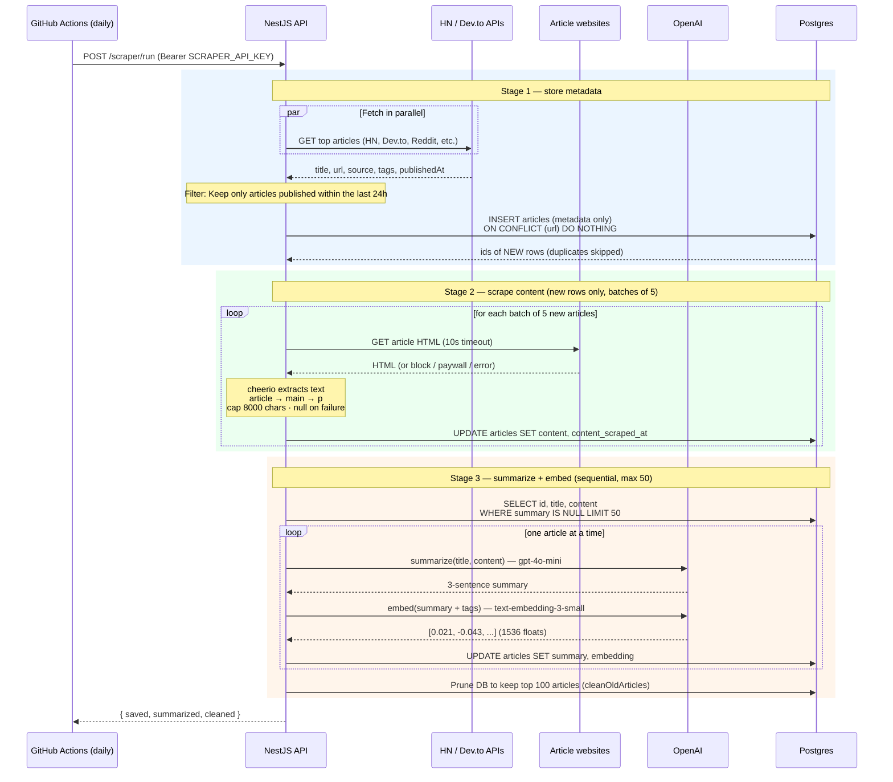
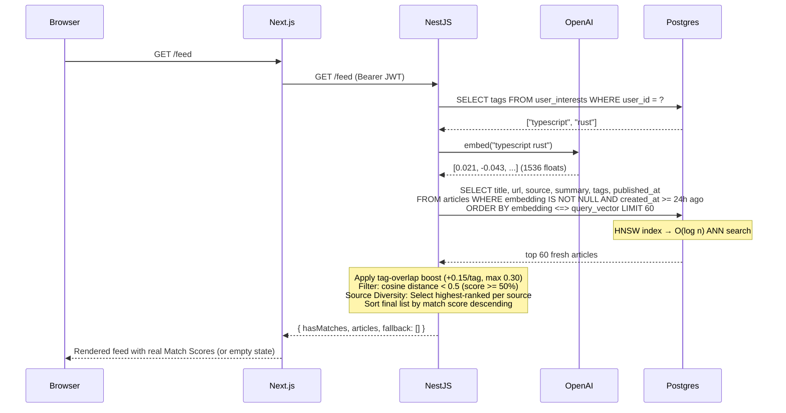
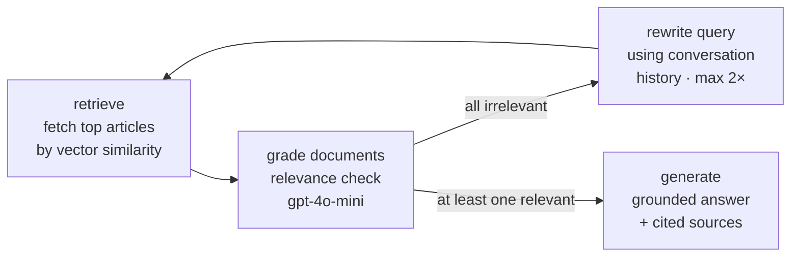

# inferr

Personalized developer news feed powered by AI. Sign in with Google, pick interest tags, get articles from Hacker News and Dev.to ranked by vector similarity. Includes an agentic RAG chat to ask questions against your feed.

## Stack

| Layer | Tech |
|---|---|
| Frontend | Next.js 15, Tailwind CSS, TypeScript |
| Backend | NestJS 11, TypeScript |
| Database | PostgreSQL 16 + pgvector (Neon in prod, Docker locally) |
| Scheduling | External cron (cron-job.org) pings `/health` every 10 min during active hours to keep the Render free-tier warm; GitHub Actions cron → `POST /scraper/run` runs the daily pipeline; `@nestjs/schedule` in-process fallback |
| ORM | Drizzle ORM |
| AI | OpenAI `gpt-4o-mini` + `text-embedding-3-small`; LangGraph agentic pipeline |
| Auth | Google OAuth 2.0 → hashed refresh token (HttpOnly cookie, 7d) + short-lived JWT access token (15m) |
| Monorepo | pnpm workspaces + Turborepo |
| Deploy | API → Render, Web → Vercel |

## System Architecture

```mermaid
graph TD
    subgraph ClientSubgraph ["Client Layer"]
        UserBrowser["User Browser (Next.js 15)"]
        McpClient["MCP Client (e.g., Claude Desktop)"]
    end

    subgraph WebSubgraph ["Web Frontend (apps/web)"]
        NextJS["Next.js App"]
    end

    subgraph APISubgraph ["NestJS API (apps/api)"]
        AppCtrl["App Controller<br/>(Health Check)"]
        AuthMod["Auth Module<br/>(Google OAuth 2.0, JWT)"]
        FeedMod["Feed Module<br/>(Personalized feed)"]
        ChatMod["Chat Module<br/>(LangGraph RAG)"]
        ScraperMod["Scraper Module<br/>(Cheerio + APIs)"]
        JobsMod["Jobs Module<br/>(Jobs & Market Reports)"]
        McpMod["MCP Module<br/>(SSE & Tools)"]
    end

    subgraph DBSubgraph ["Database Layer (PostgreSQL)"]
        Postgres[(PostgreSQL + pgvector)]
        UsersT[(users / user_interests)]
        ArticlesT[(articles / embeddings)]
        JobsT[(jobs / market_reports)]
        McpT[(mcp_tokens / mcp_clients)]
    end

    subgraph ExternalSubgraph ["External Services"]
        GoogleOAuth["Google OAuth 2.0"]
        OpenAI["OpenAI API<br/>(gpt-4o-mini / text-embedding-3-small)"]
        NewsAPIs["Hacker News & Dev.to APIs"]
        Cheerio["Article Websites (Scraping)"]
        GithubActions["GitHub Actions (Daily Cron)"]
        CronJob["cron-job.org (Keep-alive)"]
    end

    %% Connections
    UserBrowser -->|UI Interactions| NextJS
    
    NextJS -->|Authenticate| AuthMod
    NextJS -->|Fetch Feed| FeedMod
    NextJS -->|Query Chat| ChatMod
    NextJS -->|View Jobs| JobsMod
    
    McpClient -->|SSE Connection & Tool Calls| McpMod

    %% Module flows
    AuthMod -->|OAuth Consent| GoogleOAuth
    AuthMod -->|Manage Users & Sessions| UsersT

    FeedMod -->|Generate Query Vector| OpenAI
    FeedMod -->|HNSW Vector Search| ArticlesT

    ChatMod -->|Orchestrate Agent Pipeline| OpenAI
    ChatMod -->|Retrieve Related Articles| ArticlesT

    ScraperMod -->|Fetch Metadata| NewsAPIs
    ScraperMod -->|Cheerio Extract HTML| Cheerio
    ScraperMod -->|Summarize & Embed| OpenAI
    ScraperMod -->|Save Parsed Content| ArticlesT

    JobsMod -->|Trend Analysis| OpenAI
    JobsMod -->|Save Market Data| JobsT

    McpMod -->|Validate Session / Token| McpT
    McpMod -->|Expose Tools: search_articles, ask_inferr, etc.| Postgres

    %% Database internals
    Postgres === UsersT
    Postgres === ArticlesT
    Postgres === JobsT
    Postgres === McpT

    %% External cron jobs
    GithubActions -->|Trigger Pipeline| ScraperMod
    CronJob -->|Ping /health| AppCtrl

    %% Styling
    classDef client fill:#EBF5FF,stroke:#2563EB,stroke-width:2px,color:#1E3A8A;
    classDef web fill:#F0FDF4,stroke:#16A34A,stroke-width:2px,color:#14532D;
    classDef api fill:#FFF7ED,stroke:#EA580C,stroke-width:2px,color:#7C2D12;
    classDef db fill:#F5F3FF,stroke:#7C3AED,stroke-width:2px,color:#4C1D95;
    classDef external fill:#F1F5F9,stroke:#475569,stroke-width:2px,color:#0F172A;

    class UserBrowser,McpClient client;
    class NextJS web;
    class AppCtrl,AuthMod,FeedMod,ChatMod,ScraperMod,JobsMod,McpMod api;
    class Postgres,UsersT,ArticlesT,JobsT,McpT db;
    class GoogleOAuth,OpenAI,NewsAPIs,Cheerio,GithubActions,CronJob external;
```



## Structure

```
apps/
  api/    NestJS REST API       port 3001
  web/    Next.js frontend      port 3000
packages/
  types/  shared TypeScript types
docs/     architecture notes, OAuth setup, diagrams
```

## Local Setup

**Requirements:** Node.js 22, pnpm 10, Docker

```bash
# 1. Copy env
cp .env.example .env
# Fill in GOOGLE_CLIENT_ID, GOOGLE_CLIENT_SECRET, OPENAI_API_KEY, SCRAPER_API_KEY

# 2. Start Postgres
docker compose up -d

# 3. Run migrations
cd apps/api && pnpm db:migrate

# 4. Start both apps
cd ../.. && pnpm dev
```

Docker port mapping: Postgres → `5433` (avoids conflicts with local installs).

## Environment Variables

Single `.env` at repo root, loaded by both apps.

```env
DB_HOST=localhost
DB_PORT=5433
DB_USER=postgres
DB_PASS=postgres
DB_NAME=ai_feed
DB_SSL=false

API_PORT=3001
NEXT_PUBLIC_API_URL=http://localhost:3001
FRONTEND_URL=http://localhost:3000

GOOGLE_CLIENT_ID=
GOOGLE_CLIENT_SECRET=
GOOGLE_CALLBACK_URL=http://localhost:3001/auth/google/callback

JWT_SECRET=
OPENAI_API_KEY=
SCRAPER_API_KEY=
```

## Database

```bash
cd apps/api
pnpm db:generate   # generate migration SQL from schema changes
pnpm db:migrate    # apply pending migrations
pnpm db:seed       # upsert test user + interests
pnpm db:studio     # Drizzle Studio at https://local.drizzle.studio
```

Migrations run automatically on API startup in production.

**Schema tables:** `users`, `articles`, `refresh_tokens`, `mcp_tokens`, `user_interests`, `jobs`, `market_reports`, `ai_evaluations`, `mcp_clients`, `pending_mcp_authorizations`, `pending_auth_codes`

## Ingestion Pipeline

Articles are scraped, enriched, and stored in three ordered stages. A **GitHub Actions cron** runs daily, waking the Render free-tier instance and calling `POST /scraper/run` with the `SCRAPER_API_KEY`.



Each article row is written **three times** over the pipeline: metadata on insert, then `content`, then `summary` + `embedding`. Deduplication (`ON CONFLICT`), the 24-hour scraper check, and the `summary IS NULL` filter mean an article is only ever scraped and summarized **once**, saving database space and OpenAI API costs. Tags are included in the embedding input so vector similarity captures topic signals beyond the summary text.

## Feed Flow

The feed retrieves articles based on vector similarity, applying a strict 24-hour SQL filter, tag-overlap bonuses, and a source diversity check to ensure variety. If no articles clear the criteria, an empty feed is returned along with `hasMatches: false` so the UI can show a clean empty state recommending that the user expand their interests.



## Agentic Chat

The `/chat` endpoint uses a **LangGraph** stateful pipeline instead of a flat retrieve → generate chain. Multi-turn conversation history is accepted on every request.



If the grader rejects all retrieved articles, the query rewriter reformulates using conversation history and retries (up to 2 times). This prevents hallucinated answers when the feed has no relevant content for the question.

An interactive vector diagram of this agent workflow is available at [docs/agent_chat_langgraph.excalidraw](file:///home/johnvesslyalti/johnvesslyalti_workspace/inferr/docs/agent_chat_langgraph.excalidraw).


## Auth Flow

```
GET /auth/google
  → Google consent screen
  → GET /auth/google/callback
  → upsert user in DB
  → create hashed refresh token (stored as SHA-256 in refresh_tokens table)
  → set HttpOnly refresh_token cookie (7 days)
  → redirect to /auth/callback (no token in URL)

POST /auth/refresh (cookie)
  → rotate refresh token (old revoked, new issued)
  → reuse detection: recently-revoked tokens within 5s grace window follow
    the replacement chain (safe for multi-tab)
  → return { accessToken } (JWT, 15 min)

Protected routes: Authorization: Bearer <accessToken>
POST /auth/logout → revoke refresh token, clear cookie
```

## API Endpoints

| Method | Path | Auth | Description |
|---|---|---|---|
| GET | `/health` | — | Health check |
| GET | `/auth/google` | — | Start Google OAuth |
| GET | `/auth/google/callback` | — | OAuth callback, sets HttpOnly refresh cookie |
| POST | `/auth/refresh` | cookie | Rotate refresh token → return JWT access token |
| POST | `/auth/logout` | cookie | Revoke refresh token, clear cookie |
| GET | `/auth/me` | Bearer JWT | Current user + hasInterests flag |
| GET | `/users/interests` | Bearer JWT | Get saved interest tags |
| POST | `/users/interests` | Bearer JWT | Save interest tags |
| DELETE | `/users/me` | Bearer JWT | Delete user account and cascade-delete all personal data |
| GET | `/feed` | Bearer JWT | Personalized article feed with relevance filtering |
| POST | `/chat` | Bearer JWT | Agentic RAG chat (supports conversation history) |
| POST | `/scraper/run` | `SCRAPER_API_KEY` | Run full pipeline: scrape → content → summarize |
| GET | `/jobs/market` | — | Fetch job demand stats |
| GET | `/jobs/report` | — | Fetch market reports |
| POST | `/jobs/scrape` | `SCRAPER_API_KEY` | Scrape latest jobs |
| POST | `/mcp` | Bearer Token | Handle Model Context Protocol (MCP) tool call request |
| GET | `/mcp` | Bearer Token | Handle Model Context Protocol (MCP) SSE stream request |
| DELETE | `/mcp` | Bearer Token | Handle Model Context Protocol (MCP) close session request |


## Observability

Inferr integrates tracing and LLM evaluation tools to debug and monitor performance in development and production:

### 1. Application Tracing (OpenTelemetry + Jaeger)
System-wide operations (HTTP routing, database queries, and external fetches) are auto-instrumented using OpenTelemetry Node SDK ([otel.ts](file:///home/johnvesslyalti/johnvesslyalti_workspace/inferr/apps/api/src/otel.ts)):
* **Local Jaeger UI**: Accessible at [http://localhost:16686](http://localhost:16686).
* **Launch**: Runs automatically when starting services via `docker compose up -d` (uses port `4318` for HTTP OTLP trace exports).

### 2. LLM Tracing & Evaluation (Langfuse)
AI pipeline steps (the LangGraph RAG Agentic Chat, prompt revisions, document grading, and faithfulness evaluations) are tracked via Langfuse integration:
* **Local Langfuse Dashboard**: Runs at [http://localhost:3010](http://localhost:3010).
* **Launch**: Start the Langfuse PostgreSQL and web containers separately:
  ```bash
  docker compose -f docker-compose.langfuse.yml up -d
  ```
* **Configuration**: Set the keys in your `.env` file (find public/secret keys inside the local dashboard project settings):
  ```env
  LANGFUSE_PUBLIC_KEY=lf-pub-...
  LANGFUSE_SECRET_KEY=lf-sec-...
  LANGFUSE_BASE_URL=http://localhost:3010
  ```

---

## Deployment

**API (Render):** Set env vars, deploy from `Dockerfile`. `DATABASE_URL` overrides the individual `DB_*` vars. A daily GitHub Actions workflow (`.github/workflows/daily-scrape.yml`) calls `POST /scraper/run` with `SCRAPER_API_KEY` — add that secret to both Render and the GitHub repo.

**Keeping the free-tier API warm:** Render's free instance sleeps after 15 min idle. GitHub Actions cron is too unreliable for short-interval keep-alive pings, so an external pinger ([cron-job.org](https://cron-job.org)) does a `GET https://api.inferr.xyz/health` every 10 min, restricted to hours 0–18 UTC (~06:00–24:00 IST) to stay within the 750 hr/month budget. The instance is allowed to sleep overnight; the web app's wake overlay (`apps/web/src/lib/server-status.tsx`) covers the first cold request.

**Web (Vercel):** Set `NEXT_PUBLIC_API_URL` to the Render API URL. `vercel.json` at root handles the monorepo build pointing to `apps/web`.
