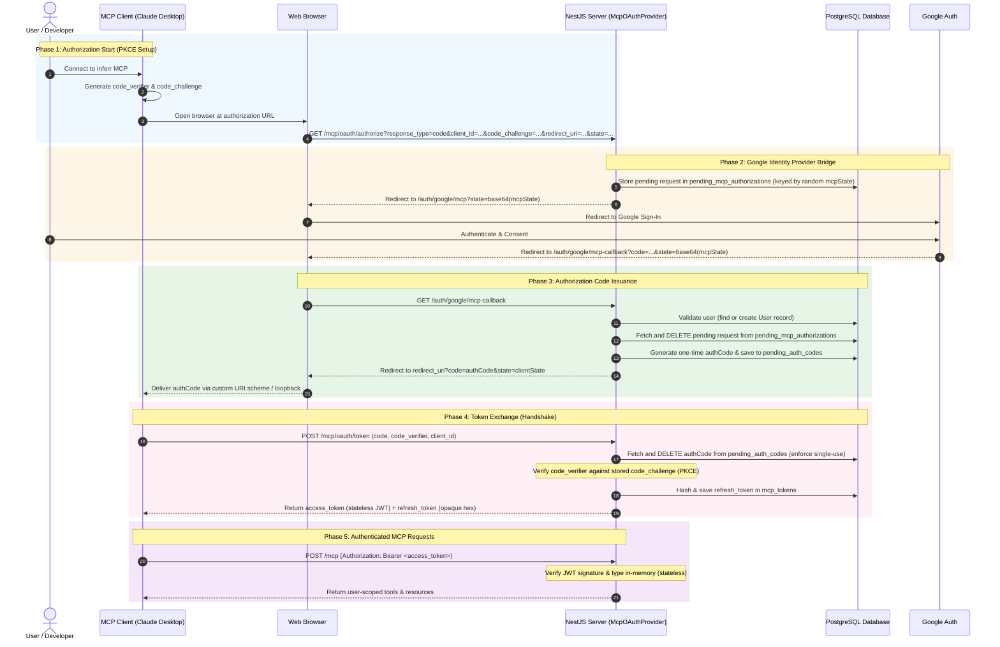

# MCP Authentication Architecture

This document describes how Model Context Protocol (MCP) clients (such as Claude Desktop, Cursor, or other developer agents) authenticate with the Inferr backend using **OAuth 2.1 with PKCE (Proof Key for Code Exchange)**.

Inferr bridges the machine-to-machine nature of MCP clients with the user's browser-based Google OAuth login.

---

## 🔄 Sequence Diagram

The diagram below outlines the five main phases of the authentication flow.

---

## 🛠️ Step-by-Step Execution Flow

### Phase 1: Authorization Start (PKCE Setup)
1. **Initiation**: The developer initiates the connection inside their MCP client.
2. **PKCE Key Generation**: The client generates a random, cryptographically secure string named `code_verifier`, hashes it using SHA-256, and encodes it to form a `code_challenge`. It also generates a random `state` string to prevent Cross-Site Request Forgery (CSRF).
3. **Redirection**: The client launches the system browser pointing to the NestJS API's authorization endpoint: `/mcp/oauth/authorize` with query parameters specifying `client_id`, `code_challenge`, `redirect_uri`, `scope`, and `state`.

### Phase 2: Google Identity Provider Bridge
4. **State Parking**: The API receives the request. Because redirecting the user to Google is a stateless action, the server stores the request context in the `pending_mcp_authorizations` table under a newly generated unique identifier `mcpState`.
5. **Google Redirection**: The API redirects the user's browser to the Google OAuth sign-in bridge (`/auth/google/mcp`) passing the `mcpState` parameter.
6. **Authentication**: The user logs in and consents on Google's domain, which then redirects the browser back to `/auth/google/mcp-callback` with a Google authorization code and the `mcpState` parameter.

### Phase 3: Authorization Code Issuance
7. **User Upsert**: The API authenticates the user with the Google profile, creating or loading the database user records.
8. **Request Retrieval**: The API decodes the callback state, retrieves and **immediately deletes** the matching record from `pending_mcp_authorizations` (preventing replay/tampering attacks).
9. **Auth Code Stash**: The API generates a short-lived (5 min) `authCode` (UUID) and stores it in `pending_auth_codes`, binding the `userId` to the client's `code_challenge` and `redirect_uri`.
10. **Client Hand-off**: The API redirects the browser back to the MCP Client's loopback address or custom URI scheme with the parameters `code=authCode` and `state=clientState`.

### Phase 4: Token Exchange
1. **Token Request**: The MCP client reads the `authCode` and sends a direct `POST` request to the token endpoint with the `code` and the original plain `code_verifier`.
2. **Single-Use Check**: The API queries the database for the auth code. To prevent replay attacks, it **deletes the code from the database immediately** in the same transaction.
3. **PKCE Verification**: The API hashes the incoming `code_verifier` and validates it against the stored `code_challenge`.
4. **Token Generation**:
   - The API issues a stateless JWT access token (valid for 1 hour) carrying the claims `{ type: 'mcp_access', sub: userId }`.
   - The API creates a cryptographically secure random refresh token (opaque 32-byte hex string), hashes it with SHA-256, and stores it in `mcp_tokens`.
5. **Response**: The API returns the access and refresh tokens to the client.

### Phase 5: Authenticated MCP Requests
1. **API Call**: The client performs actions (e.g. listing tools or running queries) by sending requests with the header `Authorization: Bearer <access_token>`.
2. **Stateless Guard**: The NestJS API verifies the JWT's signature and expiration in memory, checks that `type === 'mcp_access'`, and extracts the `userId` to scope all database queries and interactions to that specific user.

---

## 🗄️ Database Architecture & Rationale

| Table Name | Key Columns | Life Cycle | Rationale for Database Storage |
|---|---|---|---|
| **`mcp_clients`** | `client_id` (PK) `client_info` (JSONB) | Persistent | Allows dynamic client registration and verification of redirect URIs and client settings before accepting connections. |
| **`pending_mcp_authorizations`** | `state` (PK) `client_id` `code_challenge` `expires_at` | Transitory (5 min TTL) | **State Persistence**: The authorization flow involves cross-domain redirects (Client ➜ API ➜ Google ➜ API). Storing request metadata in the database allows the server to verify and reconstruct the request once Google authentication succeeds. |
| **`pending_auth_codes`** | `code` (PK) `user_id` (FK) `code_challenge` | Transitory (5 min TTL) | **Single-Use Enforcement**: OAuth 2.1 requires authorization codes to be single-use. We store codes in the database so the token exchange endpoint can query, validate, and immediately delete (`tx.delete`) them upon exchange. |
| **`mcp_tokens`** | `token_hash` (PK) `user_id` `revoked` `replaced_by_hash` | Long-lived (7 days) | **Session Security**: Storing SHA-256 hashes of refresh tokens protects against credential exposure if the DB is compromised. tracks token rotation and enables the server to detect and block replay attacks. |

### 🔒 Security Protections & Rotation Mechanics

- **One-Way Token Hashing**: Raw refresh tokens are never written to disk. Only `SHA-256(raw_refresh_token)` is stored. If an attacker reads the database, they cannot use the hash to authenticate.
- **Refresh Token Rotation (RTR)**: Every time a refresh token is used to get a new access token, the old refresh token is marked as `revoked: true` and linked to the new token via `replaced_by_hash`.
- **Automatic Replay Attack Detection**: If a client attempts to reuse a revoked refresh token, the server immediately assumes the token has been stolen. The server **revokes the entire token chain** for that user, invalidating all sessions and forcing the user to log in again.
